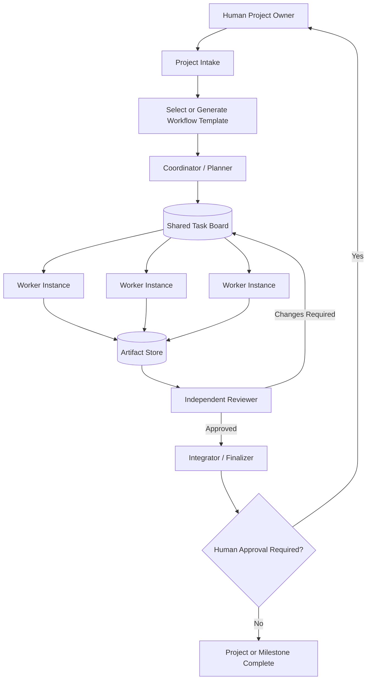
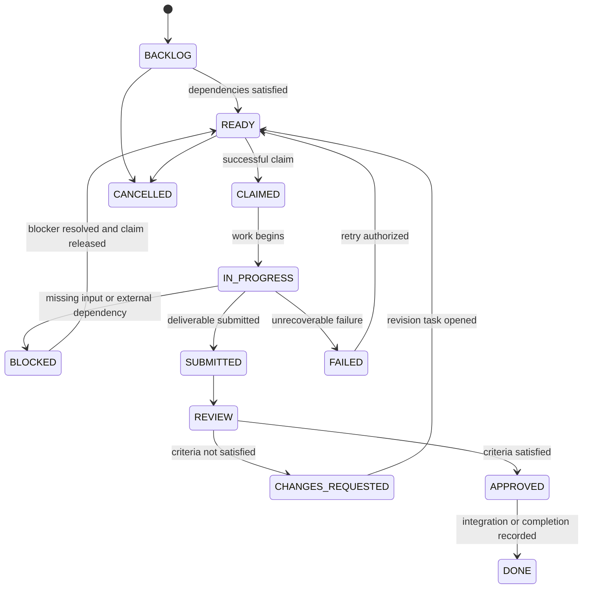
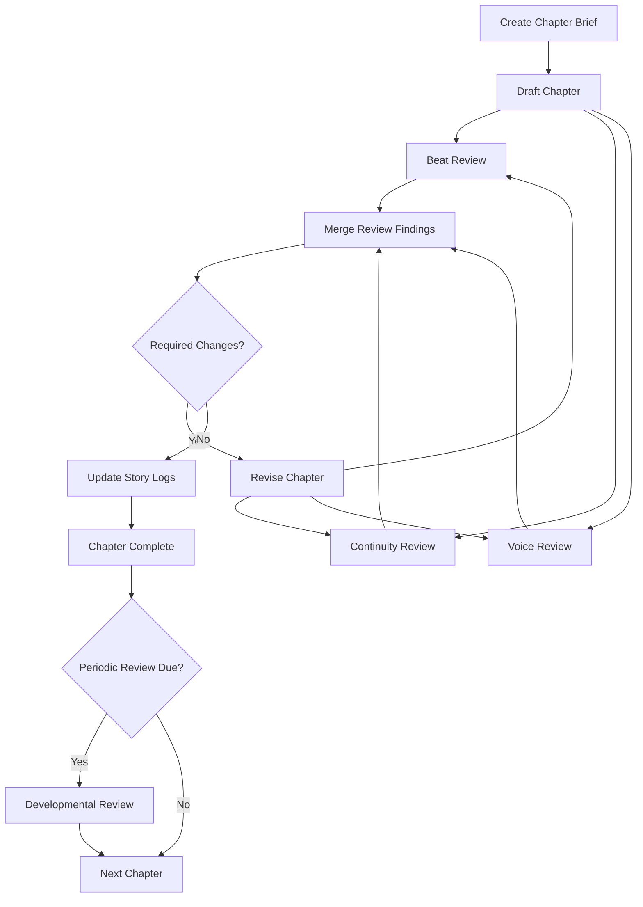
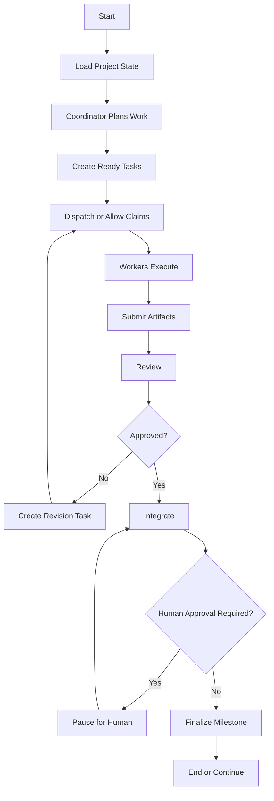

# General-Purpose Multi-Agent Project System

**Document type:** Architecture, runtime, and implementation specification  
**Status:** Implementation-ready baseline  
**Version:** 2.0  
**Date:** 2026-06-16

---

## Document Navigation

This specification is intentionally complete enough to guide both a coding agent and a human developer. The main parts are:

- **Sections 1–7:** purpose, principles, architecture, and agent model
- **Sections 8–17:** shared rules, tasks, communication, artifacts, decisions, reviews, and planning
- **Sections 18–21:** templates, project examples, writing proof of concept, and LangGraph boundaries
- **Sections 22–37:** storage, API, interface, approvals, limits, security, testing, roadmap, risks, and glossary
- **Sections 38–41:** project initialization and generated workspace files
- **Sections 42–47:** autonomous runtime, scheduling, worker behavior, and project continuation
- **Sections 48–52:** event delivery, inboxes, synchronization, versioning, and conflict handling
- **Sections 53–56:** transactions, schemas, reference control flow, and bootstrap contract
- **Sections 57–61:** deployment, observability, complete acceptance tests, final architecture, and references

---

## 1. Purpose

This document defines a general-purpose system in which multiple AI model instances collaborate on projects through structured tasks, shared project records, review gates, and controlled handoffs.

The system is not limited to writing. Writing is one workflow template among many. The same engine should support:

- fiction and nonfiction writing,
- software development,
- research,
- design,
- planning,
- data analysis,
- documentation,
- content production,
- and custom project workflows.

The underlying AI agents may all use the same model. They do not require permanent personalities or permanent specialties. Each model instance receives a temporary role, a specific task, relevant context, allowed tools, and defined authority.

The system should favor explicit responsibility over unrestricted group discussion.

---

## 2. Executive Summary

The recommended system has four cooperating layers:

1. **Universal project engine**
   - Stores projects, tasks, dependencies, assignments, decisions, messages, artifacts, reviews, approvals, schedules, and event history.
   - Enforces task states, ownership, revision limits, permissions, and human approval rules.
   - Remains mostly the same across project types.

2. **Project workflow templates**
   - Define the normal stages, task types, review criteria, project files, and approval points for a particular kind of project.
   - May be customized by a planning agent for each new project.
   - Examples include writing, software, research, design, and general problem-solving workflows.

3. **Autonomous runtime**
   - Keeps the application running without repeated human prompts.
   - Dispatches ready work, wakes workers, renews leases, retries missed events, releases abandoned tasks, and invokes the coordinator when a project needs its next phase.
   - Uses ordinary program logic for routine checks and AI calls only when judgment is required.

4. **Synchronization and communication layer**
   - Keeps agents aligned through durable shared state, event records, per-agent inboxes, acknowledgements, document versions, and reconciliation checks.
   - Agents are continuously synchronized without being kept in an unrestricted group conversation.

The core operating cycle is:

```text
DEFINE
  → PLAN
  → CREATE TASKS
  → ASSIGN OR CLAIM
  → PRODUCE ARTIFACT
  → REVIEW
  → REVISE OR APPROVE
  → INTEGRATE
  → COMPLETE
```

A workflow orchestration framework such as **LangGraph** can control routing, branching, loops, checkpoints, and human pauses. A database such as **SQLite** or **PostgreSQL** should store the durable task board and project history. Project files should be stored in ordinary folders or Git repositories.

---

## 3. Design Principles

### 3.1 One owner per task

Every active task has one accountable owner.

Other agents may:

- provide research,
- comment,
- review,
- test,
- or contribute separate artifacts.

Only the current owner should modify the primary task artifact unless ownership is formally transferred.

### 3.2 Agents are interchangeable, assignments are not

The agents may be clones of the same model. Their behavior changes through:

- task instructions,
- temporary role,
- available tools,
- context supplied,
- permissions,
- and completion criteria.

The same model instance type can act as a planner in one task and a reviewer in another.

### 3.3 Shared rules define behavior

All agents follow the same operating rules, including:

- work only on assigned or successfully claimed tasks,
- read relevant requirements and decisions before starting,
- do not silently change project scope,
- report uncertainty and blockers,
- reference artifacts rather than pasting unnecessary large content,
- do not approve your own work,
- record important decisions,
- and stop when completion criteria are satisfied.

### 3.4 Work is artifact-centered

The system should not rely on a long shared conversation as its memory.

Important work should be stored as durable artifacts:

- Markdown documents,
- source-code files,
- structured JSON,
- images,
- spreadsheets,
- tests,
- logs,
- and final deliverables.

Messages should point to artifacts rather than replacing them.

### 3.5 Models handle judgment; code handles mechanics

Use ordinary code for deterministic operations such as:

- counting completed chapters,
- checking task dependencies,
- enforcing revision limits,
- locking task claims,
- determining whether a deadline has passed,
- or moving a task between known states.

Use AI agents for tasks requiring interpretation, synthesis, creative work, or qualitative judgment.

### 3.6 Independent review is required for important work

An agent should not be the final approver of its own deliverable.

The reviewer should receive:

- the task definition,
- acceptance criteria,
- relevant project constraints,
- and the submitted artifact.

The reviewer does not need the worker’s full internal conversation unless it is relevant to the review.

### 3.7 Human authority is preserved

The system may automate routine work, but major scope, cost, ethical, legal, and strategic decisions should be escalated to the human project owner.

---

## 4. Non-Goals

The initial system should not attempt to provide:

- unlimited autonomous agent creation,
- unrestricted agent-to-agent group chat,
- agents that continuously run without active work,
- permanent personalities for every model instance,
- full organizational simulation,
- automatic approval of major strategic changes,
- or a large distributed message infrastructure before it is needed.

The first goal is a reliable task-and-review cycle, not maximum autonomy.

---

## 5. High-Level Architecture



### Core components

1. Project intake
2. Workflow template library
3. Dynamic planner
4. Task board
5. Agent registry
6. Worker pool
7. Review system
8. Artifact store
9. Decision log
10. Event log
11. Human approval queue
12. Workflow orchestrator
13. User interface

---

## 6. System Layers

### 6.1 Layer One: Universal Project Engine

The universal engine handles:

- project creation,
- project state,
- task creation,
- task dependencies,
- task assignment and claiming,
- task leases,
- task status transitions,
- agent availability,
- messages,
- artifacts,
- reviews,
- revisions,
- decisions,
- approvals,
- audit history,
- cost limits,
- and recovery after interruption.

This layer should not contain writing-specific or software-specific assumptions.

### 6.2 Layer Two: Project Templates

Templates define:

- normal stages,
- recommended temporary roles,
- expected project files,
- review types,
- approval points,
- default limits,
- and completion conditions.

Example template directory:

```text
templates/
├── writing_project.yaml
├── software_project.yaml
├── research_project.yaml
├── design_project.yaml
├── planning_project.yaml
└── general_project.yaml
```

### 6.3 Layer Three: Project-Specific Plan

The coordinator adapts a template to a particular project.

For example, a generic software template might be:

```text
Requirements → Build → Test → Release
```

A specific project may expand it into:

```text
Requirements
→ Data model
→ Interface prototype
→ Backend implementation
→ Frontend implementation
→ Integration testing
→ Accessibility review
→ Packaging
```

The template provides a starting structure. The project plan provides the actual task graph.

---

## 7. Agent Model

### 7.1 Shared underlying model

All agents may use the same language model and the same basic shared instructions.

The system differentiates them by session context.

Example session header:

```json
{
  "agent_id": "agent-04",
  "project_id": "project-12",
  "current_role": "reviewer",
  "current_task": "TASK-044",
  "authority": [
    "read_artifacts",
    "submit_review"
  ],
  "prohibited_actions": [
    "edit_submission",
    "approve_project",
    "create_unrelated_tasks"
  ]
}
```

### 7.2 Temporary roles

Recommended reusable roles include:

| Role | Responsibility |
|---|---|
| Coordinator | Creates tasks, tracks dependencies, routes work |
| Planner | Defines approach, stages, and acceptance criteria |
| Researcher | Gathers and evaluates information |
| Creator | Produces a draft, design, code, or other artifact |
| Analyst | Examines information and identifies patterns |
| Critic | Compares work against defined criteria |
| Tester | Attempts to verify behavior and reproduce failures |
| Editor | Improves clarity, consistency, or structure |
| Integrator | Combines approved outputs |
| Archivist | Updates durable project records and logs |
| Finalizer | Packages the approved final result |

These roles should normally be assigned per task rather than permanently attached to a model instance.

### 7.3 Temporary role packet

```json
{
  "role": "continuity_reviewer",
  "objective": "Check the submitted chapter against established story facts.",
  "scope": [
    "timeline",
    "character knowledge",
    "locations",
    "object state",
    "world rules"
  ],
  "deliverable": "Structured review report",
  "prohibited_actions": [
    "rewrite the chapter",
    "change project canon",
    "approve unrelated work"
  ]
}
```

### 7.4 Agent registry

The registry records operational capabilities rather than fictional personalities.

```json
{
  "agent_id": "worker-03",
  "status": "available",
  "capabilities": [
    "general_reasoning",
    "web_research",
    "python",
    "document_editing"
  ],
  "available_tools": [
    "filesystem",
    "web",
    "python"
  ],
  "maximum_concurrent_tasks": 1,
  "current_task_id": null
}
```

---

## 8. Shared Agent Guidelines

Every agent should receive a common rules file.

Suggested location:

```text
shared/agent_rules.md
```

Suggested content:

```text
You are one participant in a structured multi-agent project system.

General rules:

1. Work only on a task assigned to you or successfully claimed by you.
2. Read the task, acceptance criteria, relevant requirements, and approved decisions before starting.
3. Do not change project scope or requirements without recording a proposal and receiving approval.
4. Do not modify artifacts owned by another active task unless the system explicitly authorizes it.
5. Report blockers, uncertainty, missing information, and failed attempts.
6. Store substantial work in the required artifact location.
7. Use structured messages and include the task ID.
8. Do not declare your own work finally approved.
9. Do not continue after the task completion conditions are met.
10. Prefer evidence and reproducible examples over unsupported claims.
```

---

## 9. Task Model

### 9.1 Required task fields

```json
{
  "task_id": "TASK-014",
  "project_id": "PROJECT-003",
  "title": "Create the task-board database",
  "description": "Create the database schema used for agents, tasks, messages, and artifacts.",
  "task_type": "create",
  "temporary_role": "builder",
  "assigned_to": "worker-02",
  "status": "READY",
  "priority": 2,
  "dependencies": [
    "TASK-011"
  ],
  "acceptance_criteria": [
    "Stores projects, tasks, messages, reviews, and artifacts",
    "Prevents two agents from claiming the same task",
    "Records task status changes"
  ],
  "input_artifacts": [
    "docs/architecture.md"
  ],
  "output_artifacts": [],
  "created_by": "coordinator",
  "attempt": 1,
  "maximum_attempts": 3
}
```

### 9.2 Task states

Use a controlled state list:

```text
BACKLOG
READY
CLAIMED
IN_PROGRESS
BLOCKED
SUBMITTED
REVIEW
CHANGES_REQUESTED
APPROVED
DONE
FAILED
CANCELLED
```

### 9.3 State-transition rules



A worker may submit work but should not move its own task directly to `APPROVED` or `DONE`.

---

## 10. Assignment and Claiming

The system should support both direct assignment and open claiming.

### 10.1 Direct assignment

Use direct assignment when:

- only one agent has the required tool access,
- tasks must occur in a strict sequence,
- file ownership must remain predictable,
- the work is sensitive,
- or a reviewer must remain independent.

### 10.2 Open claiming

Use claiming when:

- several agents are equivalent,
- tasks are independent,
- parallel work is useful,
- and no special agent identity is required.

### 10.3 Atomic claims

A claim must be atomic: only one worker may successfully claim a task.

Conceptual sequence:

```text
1. Worker requests TASK-014.
2. Database confirms TASK-014 is READY.
3. Database changes status to CLAIMED.
4. Database records worker ID and lease expiration.
5. Transaction commits.
6. Other claim attempts fail.
```

### 10.4 Task leases

A lease is a temporary task claim.

Required fields:

```json
{
  "task_id": "TASK-014",
  "claimed_by": "worker-02",
  "claimed_at": "2026-06-16T15:00:00Z",
  "lease_expires_at": "2026-06-16T15:30:00Z",
  "heartbeat_at": "2026-06-16T15:20:00Z"
}
```

If the agent stops responding, the lease can expire and the task can return to `READY`.

---

## 11. Communication Protocol

### 11.1 Communication should be task-centered

Agents should normally communicate through messages attached to a task or project decision.

Avoid a single unrestricted chat history for the entire project.

### 11.2 Message types

Recommended message types:

```text
TASK_CREATED
TASK_ASSIGNED
TASK_CLAIMED
PROGRESS
QUESTION
ANSWER
BLOCKED
HANDOFF
SUBMISSION
REVIEW_REQUESTED
CHANGES_REQUESTED
APPROVED
FAILED
DECISION_PROPOSED
DECISION_RECORDED
HUMAN_INPUT_REQUIRED
```

### 11.3 Message schema

```json
{
  "message_id": "MSG-238",
  "project_id": "PROJECT-003",
  "task_id": "TASK-014",
  "sender": "worker-02",
  "recipient": "coordinator",
  "type": "BLOCKED",
  "summary": "The database location has not been decided.",
  "details": "The task requires a decision between a project-local database and a shared database.",
  "artifact_paths": [],
  "requires_response": true,
  "created_at": "2026-06-16T15:42:00Z"
}
```

### 11.4 Handoff schema

```json
{
  "type": "HANDOFF",
  "task_id": "TASK-014",
  "sender": "worker-02",
  "recipient": "reviewer-01",
  "summary": "Database schema and migration script are ready for review.",
  "artifact_paths": [
    "artifacts/database/schema.sql",
    "artifacts/database/migration.py"
  ],
  "known_limitations": [
    "PostgreSQL support is not included in this version."
  ]
}
```

---

## 12. Artifact Model

### 12.1 Artifact types

The system should support:

- source documents,
- code,
- images,
- structured data,
- research notes,
- designs,
- reviews,
- test reports,
- decisions,
- summaries,
- exported deliverables,
- and archived versions.

### 12.2 Artifact record

```json
{
  "artifact_id": "ART-092",
  "project_id": "PROJECT-003",
  "task_id": "TASK-014",
  "path": "artifacts/database/schema.sql",
  "artifact_type": "source_code",
  "version": 2,
  "created_by": "worker-02",
  "created_at": "2026-06-16T16:05:00Z",
  "status": "submitted",
  "checksum": "optional-content-hash"
}
```

### 12.3 Artifact ownership

Each active artifact should have:

- one owning task,
- one current editor,
- a version,
- and a review state.

Agents should not silently overwrite another task’s artifact.

### 12.4 Version control

Use Git when projects contain code or text that benefits from revision history.

Recommended practices:

- one branch or worktree per active implementation task,
- commits tied to task IDs,
- reviews against diffs,
- and tagged milestones for approved releases.

For small projects, numbered artifact versions may be sufficient.

---

## 13. Project Memory and Context

### 13.1 Context layers

#### Global project context

Available to most agents:

- project objective,
- requirements,
- approved decisions,
- definitions,
- current milestone,
- and important constraints.

#### Task context

Available to the assigned worker:

- task definition,
- acceptance criteria,
- dependencies,
- relevant artifacts,
- required output location,
- and task-specific instructions.

#### Private working context

Available only to the active model instance:

- temporary notes,
- intermediate attempts,
- and tool outputs that do not need to become permanent project memory.

#### Review context

Available to the reviewer:

- original task,
- acceptance criteria,
- relevant constraints,
- submitted artifact,
- and previous review findings when reviewing a revision.

### 13.2 Durable project documents

Recommended shared documents:

```text
shared/
├── project_brief.md
├── requirements.md
├── decisions.md
├── glossary.md
├── constraints.md
├── unresolved_questions.md
└── agent_rules.md
```

Project-specific templates may add files such as:

```text
writing/
├── characters.md
├── world.md
├── timeline.md
└── style_guide.md
```

or:

```text
software/
├── architecture.md
├── api_contracts.md
├── data_model.md
└── coding_standards.md
```

### 13.3 Context selection

Do not give every agent every project file.

The coordinator or context builder should select only what is relevant to the task. This reduces cost, confusion, and accidental influence from unrelated material.

---

## 14. Decisions and Canonical Project Truth

### 14.1 Decision log

Project-wide decisions should be recorded separately from ordinary discussion.

```json
{
  "decision_id": "DEC-018",
  "project_id": "PROJECT-003",
  "title": "Use SQLite for the local first version",
  "status": "approved",
  "reason": "The first version runs on one machine and does not require distributed concurrency.",
  "alternatives_considered": [
    "JSON files",
    "PostgreSQL"
  ],
  "approved_by": "human",
  "affected_tasks": [
    "TASK-014",
    "TASK-019"
  ]
}
```

### 14.2 Proposed versus approved decisions

Agents may propose decisions, but the system should distinguish:

- proposed,
- under review,
- approved,
- superseded,
- and rejected.

Only approved decisions should be treated as canonical project truth.

---

## 15. Review System

### 15.1 Review packet

A reviewer should receive:

```json
{
  "review_id": "REV-031",
  "task_id": "TASK-014",
  "review_type": "technical",
  "artifact_paths": [
    "artifacts/database/schema.sql"
  ],
  "acceptance_criteria": [
    "All required entities are represented",
    "Foreign-key relationships are valid",
    "Task claiming can be implemented atomically"
  ],
  "reviewer": "reviewer-01"
}
```

### 15.2 Structured findings

```json
{
  "review_id": "REV-031",
  "result": "changes_required",
  "findings": [
    {
      "finding_id": "F-001",
      "severity": "required",
      "location": "tasks table",
      "issue": "No field records task lease expiration.",
      "evidence": "The schema includes claimed_by but no lease_expires_at.",
      "recommended_action": "Add lease_expires_at and heartbeat_at fields."
    }
  ]
}
```

### 15.3 Finding severities

Use a controlled set:

```text
BLOCKER
REQUIRED
RECOMMENDED
OPTIONAL
```

Only `BLOCKER` and `REQUIRED` findings should automatically prevent approval.

### 15.4 Revision packets

The coordinator converts review findings into an actionable revision packet.

```json
{
  "task_id": "TASK-014",
  "revision": 2,
  "required_changes": [
    {
      "finding_id": "F-001",
      "instruction": "Add lease expiration and heartbeat fields."
    }
  ],
  "optional_changes": [],
  "prohibited_changes": [
    "Do not replace SQLite with another database."
  ]
}
```

### 15.5 Revision limits

Set limits to prevent endless loops.

Example:

```yaml
limits:
  maximum_task_attempts: 3
  maximum_review_cycles: 3
```

After the limit is reached, the task should move to `HUMAN_INPUT_REQUIRED` or `FAILED`, depending on project policy.

---

## 16. Coordinator Responsibilities

The coordinator is another model instance with a management instruction packet.

Its responsibilities include:

- interpret the project objective,
- select or propose a workflow,
- create tasks,
- define acceptance criteria,
- identify dependencies,
- assign or publish tasks,
- monitor blocked work,
- collect review results,
- create revision tasks,
- enforce limits,
- update project status,
- and escalate decisions to the human owner.

The coordinator should not automatically perform every specialist task. Otherwise it becomes a single overloaded agent rather than an orchestrator.

Suggested coordinator instruction:

```text
Temporary role: Project Coordinator

Your responsibilities:
- Convert the approved project objective into a task graph.
- Define clear deliverables and acceptance criteria.
- Prevent overlapping ownership.
- Track dependencies and blockers.
- Route submissions to independent review.
- Record approved decisions.
- Escalate major scope changes and unresolved conflicts to the human owner.
- Do not perform implementation work unless explicitly assigned.
- Do not approve work without reviewer evidence.
```

---

## 17. Dynamic Planning

### 17.1 Template plus customization

The recommended planning formula is:

```text
Existing template
      +
Coordinator customization
      =
Project-specific workflow
```

### 17.2 Generated task graph

When no template fits, the coordinator may generate a new workflow.

Example objective:

```text
Organize a large retro-game collection.
```

Possible graph:

```text
Inventory files
→ Identify duplicates
→ Classify systems
→ Research unknown titles
→ Score games by user preferences
→ Create recommended collection
→ Validate filenames
```

The generated graph must still follow the universal task rules:

- one owner per task,
- explicit dependencies,
- defined deliverables,
- acceptance criteria,
- review,
- and revision limits.

### 17.3 Plan approval

For large projects, the human should approve the generated workflow before execution begins.

---

## 18. Workflow Template Format

A workflow template may be stored as YAML.

```yaml
template:
  id: software_project
  version: 1
  name: Software Project

default_roles:
  - coordinator
  - planner
  - builder
  - reviewer
  - tester
  - integrator

human_approval:
  - requirements
  - architecture
  - release

limits:
  maximum_parallel_tasks: 4
  maximum_review_cycles: 3
  maximum_agent_calls: 60

stages:
  - id: requirements
    task_type: create
    role: planner
    output: shared/requirements.md

  - id: architecture
    task_type: create
    role: planner
    depends_on:
      - requirements
    output: shared/architecture.md

  - id: implementation
    task_type: create
    role: builder
    depends_on:
      - architecture
    output: src/

  - id: code_review
    task_type: review
    role: reviewer
    depends_on:
      - implementation

  - id: testing
    task_type: test
    role: tester
    depends_on:
      - implementation

  - id: revision
    task_type: revise
    role: builder
    condition: review.changes_required

  - id: release
    task_type: integrate
    role: integrator
    depends_on:
      - code_review
      - testing
```

The engine translates this template into runtime tasks and workflow routes.

---

## 19. Example Project Templates

### 19.1 Writing project

```text
Concept
→ Story specification
→ Outline
→ Chapter brief
→ Draft
→ Beat review
→ Continuity review
→ Voice review
→ Revision
→ Update story records
→ Chapter complete
→ Periodic developmental review
```

### 19.2 Software project

```text
Requirements
→ Architecture
→ Task decomposition
→ Implementation
→ Code review
→ Automated tests
→ Integration tests
→ Fixes
→ Documentation
→ Release approval
```

### 19.3 Research project

```text
Research question
→ Search strategy
→ Source collection
→ Source evaluation
→ Evidence extraction
→ Analysis
→ Counterargument review
→ Synthesis
→ Citation audit
→ Final report
```

### 19.4 Design project

```text
Brief
→ Requirements
→ References
→ Concepts
→ Draft design
→ Usability review
→ Accessibility review
→ Revision
→ Export
```

### 19.5 General problem-solving project

```text
Define problem
→ Identify constraints
→ Generate approaches
→ Compare approaches
→ Select approach
→ Implement
→ Validate
→ Document result
```

---

## 20. Writing Workflow as a Proof of Concept

The writing workflow is a useful first project template because it demonstrates:

- sequential stages,
- parallel review,
- revision loops,
- shared records,
- periodic reviews,
- and human creative control.

### 20.1 Foundation stage

Suggested files:

```text
foundation/
├── concept.md
├── novel_spec.md
├── outline.md
├── style_guide.md
└── themes.md
```

### 20.2 Story records

```text
bibles/
├── characters.md
├── world.md
├── locations.md
├── objects.md
└── terminology.md

continuity/
├── timeline.md
├── continuity_log.md
├── unresolved_threads.md
└── character_state.json
```

### 20.3 Chapter workflow



### 20.4 Chapter brief example

```json
{
  "chapter_number": 7,
  "purpose": "The protagonist discovers that a trusted character concealed the manuscript's origin.",
  "required_beats": [
    "The protagonist notices a missing page",
    "The trusted character gives an incomplete explanation",
    "A third character observes without intervening",
    "The protagonist takes the manuscript"
  ],
  "point_of_view": "protagonist",
  "target_words": {
    "minimum": 2200,
    "maximum": 3200
  },
  "must_preserve": [
    "The protagonist does not yet understand the magic system",
    "The trusted character cannot directly lie",
    "The observer has not revealed allegiance"
  ]
}
```

### 20.5 Review separation

Reviewers should receive separate assignments:

- beat reviewer: structure, pacing, causality, required events,
- continuity reviewer: established facts, timeline, knowledge, object state,
- voice reviewer: point of view, tone, dialogue, style-guide compliance.

This is preferable to telling several agents to “review everything,” because it reduces duplication and creates clearer accountability.

### 20.6 Periodic developmental review

After a configured number of chapters, the system should review the larger arc:

- pacing,
- character progression,
- repeated scene structures,
- plot-thread balance,
- thematic development,
- buildup and payoff,
- and alignment with the intended ending.

The output should be action items, not silent large-scale rewrites.

---

## 21. LangGraph’s Role

LangGraph should be treated as the workflow orchestrator, not as the entire project database or artifact system.

### 21.1 Use LangGraph for

- graph routing,
- conditional branches,
- loops,
- parallel review nodes,
- pauses for human input,
- retries,
- checkpoints,
- and resuming interrupted workflows.

### 21.2 Use a database for

- projects,
- tasks,
- assignments,
- messages,
- decisions,
- artifact records,
- review records,
- approvals,
- and event history.

### 21.3 Use files or Git for

- source code,
- manuscripts,
- research reports,
- design files,
- test reports,
- and final outputs.

### 21.4 Relationship

```text
Project template or generated plan
              ↓
Workflow builder
              ↓
LangGraph execution graph
              ↓
Database-backed task board
              ↓
Agents, tools, and artifacts
```

### 21.5 Generic execution graph



### 21.6 Framework boundary

The project definition should remain external to LangGraph so new templates can be created without rewriting the complete application.

---

## 22. Suggested Data Store

### 22.1 Initial choice

Use SQLite for the first local version.

Reasons:

- simple deployment,
- transactions,
- adequate support for a small local worker pool,
- easy inspection,
- and no separate server requirement.

Move to PostgreSQL when the system requires:

- many concurrent workers,
- remote access,
- multiple application servers,
- stronger operational controls,
- or larger-scale reporting.

### 22.2 Suggested tables

```text
projects
project_members
agents
agent_sessions
workflow_templates
workflow_instances
tasks
task_dependencies
task_claims
messages
artifacts
artifact_versions
reviews
review_findings
revision_requests
decisions
approvals
events
usage_records
```

### 22.3 Minimum task-board schema

```sql
CREATE TABLE tasks (
    task_id TEXT PRIMARY KEY,
    project_id TEXT NOT NULL,
    title TEXT NOT NULL,
    description TEXT NOT NULL,
    task_type TEXT NOT NULL,
    temporary_role TEXT,
    status TEXT NOT NULL,
    priority INTEGER NOT NULL DEFAULT 3,
    assigned_to TEXT,
    claimed_by TEXT,
    lease_expires_at TEXT,
    heartbeat_at TEXT,
    attempt INTEGER NOT NULL DEFAULT 1,
    maximum_attempts INTEGER NOT NULL DEFAULT 3,
    created_at TEXT NOT NULL,
    updated_at TEXT NOT NULL
);
```

The production schema should also use foreign keys, indexes, constraints, and migration scripts.

---

## 23. Suggested Project Directory

```text
multi_agent_system/
├── app/
│   ├── api/
│   ├── orchestration/
│   ├── agents/
│   ├── tasks/
│   ├── reviews/
│   ├── context/
│   ├── artifacts/
│   └── database/
├── templates/
│   ├── writing_project.yaml
│   ├── software_project.yaml
│   ├── research_project.yaml
│   ├── design_project.yaml
│   └── general_project.yaml
├── prompts/
│   ├── shared_agent_rules.md
│   ├── coordinator.md
│   ├── worker.md
│   ├── reviewer.md
│   └── integrator.md
├── projects/
│   └── PROJECT-001/
│       ├── project.yaml
│       ├── shared/
│       ├── tasks/
│       ├── artifacts/
│       ├── reviews/
│       ├── logs/
│       └── exports/
├── tests/
├── migrations/
├── config/
└── README.md
```

---

## 24. API Outline

A local API can expose the core operations.

```text
POST /projects
GET  /projects/{project_id}
POST /projects/{project_id}/plan

POST /tasks
GET  /tasks/{task_id}
POST /tasks/{task_id}/claim
POST /tasks/{task_id}/heartbeat
POST /tasks/{task_id}/release
POST /tasks/{task_id}/start
POST /tasks/{task_id}/block
POST /tasks/{task_id}/submit

POST /tasks/{task_id}/messages
GET  /tasks/{task_id}/messages

POST /reviews
POST /reviews/{review_id}/findings
POST /reviews/{review_id}/complete

POST /decisions
POST /decisions/{decision_id}/approve

POST /approvals
POST /approvals/{approval_id}/respond

GET  /agents/{agent_id}/work
GET  /projects/{project_id}/status
GET  /projects/{project_id}/events
```

---

## 25. User Interface

### 25.1 Main dashboard

The dashboard should show:

- project objective,
- current milestone,
- active tasks,
- blocked tasks,
- pending reviews,
- pending human approvals,
- agent status,
- recent decisions,
- cost or token usage,
- and final artifacts.

### 25.2 Kanban view

Suggested columns:

```text
BACKLOG
READY
IN PROGRESS
BLOCKED
REVIEW
CHANGES REQUESTED
DONE
```

### 25.3 Workflow view

Display task dependencies as a graph.

The user should be able to see:

- which tasks are parallel,
- which tasks block others,
- which node is active,
- and where revision loops are occurring.

### 25.4 Artifact view

Show:

- artifact name,
- owner,
- task,
- version,
- status,
- reviewers,
- and diff or preview.

### 25.5 Approval queue

Human approval cards should clearly state:

- what decision is required,
- why it matters,
- available options,
- expected consequences,
- and the coordinator’s recommendation.

---

## 26. Human Approval Policy

Recommended approval points include:

- project objective,
- generated project plan for large projects,
- requirements,
- architecture,
- major scope changes,
- destructive operations,
- legal or financial decisions,
- public release,
- and final project completion.

The system should not autonomously:

- remove central requirements,
- change the intended audience,
- make irreversible external changes,
- spend beyond configured limits,
- send public communications,
- or overwrite approved milestones

without explicit authority.

---

## 27. Cost and Runaway Controls

Each project should define limits.

```yaml
limits:
  maximum_parallel_tasks: 4
  maximum_active_agents: 4
  maximum_task_attempts: 3
  maximum_review_cycles: 3
  maximum_agent_calls: 60
  maximum_project_cost_usd: 25
  task_lease_minutes: 30
  idle_agent_timeout_minutes: 10
```

The system should stop or request human input when a limit is reached.

Additional controls:

- do not run agents without a ready task,
- summarize old task history,
- provide only relevant context,
- use smaller models for routine classification,
- use code instead of models for deterministic decisions,
- cache unchanged project context,
- and prevent duplicate tasks.

---

## 28. Security and Permissions

Each agent session should have least-privilege access.

Examples:

- a reviewer may read submitted code but not modify it,
- a research agent may use web search but not deploy software,
- a builder may edit its working directory but not approved releases,
- an archivist may propose record updates but not alter source artifacts,
- and an external-communication agent may draft messages but require approval before sending.

The system should log:

- tool calls,
- file modifications,
- task transitions,
- approval decisions,
- external actions,
- and errors.

Secrets should not be placed in prompts or project files. Use environment variables or a secrets manager.

---

## 29. Observability and Audit History

Maintain an append-only event log.

Example:

```json
{"event":"task_created","task_id":"TASK-014","agent":"coordinator"}
{"event":"task_claimed","task_id":"TASK-014","agent":"worker-02"}
{"event":"artifact_submitted","task_id":"TASK-014","artifact_id":"ART-092"}
{"event":"changes_requested","task_id":"TASK-014","agent":"reviewer-01"}
{"event":"task_approved","task_id":"TASK-014","agent":"coordinator"}
```

The log supports:

- debugging,
- recovery,
- accountability,
- cost analysis,
- quality analysis,
- and later system improvement.

Do not edit old events. Add corrective events when necessary.

---

## 30. Testing Strategy

### 30.1 Unit tests

Test deterministic components:

- task-state transitions,
- dependency resolution,
- claim locking,
- lease expiration,
- permission checks,
- revision limits,
- template validation,
- and artifact-path rules.

### 30.2 Integration tests

Test workflows such as:

- task creation through approval,
- failed worker recovery,
- blocked task resolution,
- parallel review completion,
- human approval pauses,
- and project resume after shutdown.

### 30.3 Agent behavior tests

Create standard test projects and evaluate whether agents:

- stay within scope,
- use correct artifacts,
- satisfy acceptance criteria,
- report uncertainty,
- avoid self-approval,
- and stop appropriately.

### 30.4 Failure injection

Deliberately test:

- an agent disappearing after claiming a task,
- two agents claiming simultaneously,
- malformed review output,
- missing project files,
- conflicting review findings,
- context-window overflow,
- tool failure,
- and human rejection of a milestone.

---

## 31. Implementation Roadmap

### Phase 1: Manual proof of concept

Build:

- one project,
- one coordinator,
- two workers,
- one reviewer,
- Markdown files,
- JSON task records,
- and a manual command-line runner.

Goal:

```text
CREATE → CLAIM → WORK → SUBMIT → REVIEW → ACCEPT OR REVISE
```

### Phase 2: SQLite task board

Add:

- project table,
- task table,
- dependency table,
- task claims,
- messages,
- artifacts,
- reviews,
- and event log.

### Phase 3: LangGraph orchestration

Add:

- workflow state,
- conditional routing,
- review loops,
- parallel nodes,
- checkpoints,
- and human pauses.

### Phase 4: Template engine

Add:

- writing template,
- software template,
- research template,
- general template,
- and project-specific customization.

### Phase 5: Web dashboard

Add:

- task board,
- workflow graph,
- artifact browser,
- approval queue,
- agent status,
- and event history.

### Phase 6: Reliability and scaling

Add:

- model selection by task type,
- cost tracking,
- retries,
- failure recovery,
- PostgreSQL option,
- remote workers,
- stronger permissions,
- and automated evaluation.

---

## 32. Recommended Initial Technology Stack

```text
Language:          Python
Workflow engine:   LangGraph
Validation:        Pydantic
Database:          SQLite initially
Database layer:    SQLAlchemy or direct SQLite
API:               FastAPI
User interface:    Simple HTML/CSS/JavaScript initially
Artifacts:         Local project folders
Version control:   Git
Configuration:     YAML
Structured output: JSON
Testing:           Pytest
```

This stack is a recommendation, not a requirement. The architecture should not depend entirely on one model provider.

---

## 33. Minimum Viable Product

The first useful version should contain:

- one user-created project,
- one workflow template,
- one coordinator,
- a pool of identical workers,
- one independent reviewer,
- SQLite task storage,
- artifact folders,
- structured JSON messages,
- task claims with expiration,
- revision limits,
- and a simple status screen.

The MVP does not need:

- remote workers,
- a complex message broker,
- autonomous agent creation,
- advanced semantic memory,
- or many project templates.

### MVP acceptance criteria

1. A user can create a project with an objective.
2. The coordinator can generate a task graph.
3. The user can approve the plan.
4. Workers can claim ready tasks without duplicate claims.
5. Workers can submit artifacts.
6. Reviewers can issue structured findings.
7. Failed review creates a revision task.
8. Approved work unlocks dependent tasks.
9. The project can resume after application restart.
10. The user can inspect task history and final artifacts.

---

## 34. Key Architectural Decisions

### Decision 1: Temporary roles instead of permanent agent identities

Reason:

- model instances are interchangeable,
- temporary roles use capacity more efficiently,
- and task packets create clearer behavior than elaborate personalities.

### Decision 2: Structured tasks instead of open group chat

Reason:

- clear ownership,
- lower duplication,
- better auditability,
- lower token use,
- and easier recovery.

### Decision 3: Templates plus dynamic planning

Reason:

- fixed templates provide reliability,
- dynamic planning supports unusual projects,
- and project-specific changes do not require rebuilding the whole engine.

### Decision 4: Database for coordination, files for artifacts

Reason:

- databases are suited to state, locks, status, and queries,
- while ordinary files are better for code, manuscripts, designs, and reports.

### Decision 5: LangGraph for orchestration, not total storage

Reason:

- workflow routing and checkpoints are separate concerns from durable project records and artifact management.

---

## 35. Risks and Mitigations

| Risk | Mitigation |
|---|---|
| Duplicate work | Atomic claims and one owner per task |
| Endless revision loops | Maximum attempts and human escalation |
| Agents changing scope | Approved requirements and decision log |
| Context overload | Task-specific context selection |
| Conflicting edits | Artifact ownership and version control |
| Reviewer bias | Independent review context |
| Manager becoming a bottleneck | Open claiming for routine ready tasks |
| Excessive cost | Call, token, time, and budget limits |
| Lost work after failure | Database persistence and workflow checkpoints |
| Unsupported conclusions | Evidence requirements and structured findings |
| Too much complexity | Build the task cycle before advanced autonomy |

---

## 36. Open Design Questions

The following decisions should be made during implementation:

1. Will the system run locally only or support remote workers?
2. Which model providers must be supported?
3. Should agents poll for work or receive pushed assignments?
4. How should context be selected and summarized?
5. Which project decisions always require human approval?
6. Should reviewer disagreements be resolved by the coordinator or by another review round?
7. How should binary and visual artifacts be versioned?
8. When should SQLite be replaced by PostgreSQL?
9. Should each task receive a separate Git branch or worktree?
10. How should model and tool costs be allocated per task?
11. Which project templates should be included in the first release?
12. How much planning autonomy should the coordinator receive?

---

## 37. Glossary

**Agent:** A running model instance with instructions, context, tools, and authority.

**Artifact:** A durable work product such as a document, code file, image, test report, or dataset.

**Atomic claim:** A database operation that allows only one worker to claim a ready task.

**Checkpoint:** A saved workflow state that allows execution to resume or branch later.

**Coordinator:** The temporary role responsible for planning, routing, dependencies, and escalation.

**Dependency:** A task or condition that must be completed before another task becomes ready.

**Lease:** A temporary task claim that expires if the worker stops responding.

**Project template:** A reusable definition of normal stages, roles, files, reviews, and approval rules.

**Review gate:** A point where work must satisfy defined criteria before it can proceed.

**Task graph:** A network of tasks connected by dependencies and conditional routes.

**Temporary role:** A role assigned for one task or stage rather than permanently attached to an agent.

**Workflow orchestrator:** The component that determines what runs next and manages branches, loops, pauses, and resumption.

---

---

## 38. Project Initialization Protocol

The architecture is only useful if a new goal can be converted into a valid project workspace and executable task graph. Project initialization is therefore a mandatory system operation, not an informal planning conversation.

### 38.1 Initialization input

A new project request should be normalized into this structure:

```json
{
  "goal": "Create a distraction-free browser puzzle game.",
  "explicit_requirements": [
    "Runs locally in a browser",
    "Uses a dark #2a2a2a background",
    "Uses muted pastel regions"
  ],
  "constraints": [
    "No external dependencies"
  ],
  "known_preferences": [],
  "deadline": null,
  "budget": null,
  "approval_policy": "standard",
  "requested_outputs": [
    "working application",
    "documentation"
  ]
}
```

The initializer must separate:

- facts explicitly provided by the user,
- safe operational defaults,
- assumptions that need confirmation,
- and unresolved questions that block planning.

It must not silently convert uncertain assumptions into approved requirements.

### 38.2 Mandatory initialization sequence

When a new goal is received, the system performs this sequence:

```text
RECEIVE GOAL
    ↓
NORMALIZE OBJECTIVE
    ↓
IDENTIFY REQUIREMENTS, CONSTRAINTS, AND UNKNOWNS
    ↓
SELECT CLOSEST WORKFLOW TEMPLATE
    ↓
CUSTOMIZE OR GENERATE PROJECT WORKFLOW
    ↓
CREATE PROJECT DIRECTORY AND DATABASE RECORDS
    ↓
CREATE SHARED PROJECT DOCUMENTS
    ↓
GENERATE TASK GRAPH
    ↓
VALIDATE GRAPH AND FILE REFERENCES
    ↓
IDENTIFY HUMAN APPROVAL POINTS
    ↓
REQUEST PLAN APPROVAL WHEN REQUIRED
    ↓
ACTIVATE INITIAL READY TASKS
    ↓
NOTIFY DISPATCHER
```

### 38.3 Initialization rules

The initializer must:

1. Create a stable project ID.
2. Create a normalized completion condition.
3. Select one primary project template.
4. Record any secondary template features that are being borrowed.
5. Create a task graph with explicit dependencies.
6. Give each task a deliverable and acceptance criteria.
7. Identify at least one initial `READY` task.
8. Reject circular dependencies.
9. Reject output paths that collide between simultaneously active tasks.
10. define human approval gates.
11. Define project cost, retry, and concurrency limits.
12. Save the plan before dispatching work.
13. Produce a clear initialization report.

### 38.4 Blocking versus non-blocking questions

A missing detail is **blocking** only when proceeding would likely:

- create the wrong project,
- cause destructive or expensive work,
- violate a stated constraint,
- force a major design choice,
- or make the deliverable impossible to evaluate.

Non-blocking details should be recorded as assumptions or delegated research tasks rather than stopping the project unnecessarily.

### 38.5 Initialization output

A successful initialization returns:

```json
{
  "project_id": "PROJECT-20260616-001",
  "project_path": "projects/PROJECT-20260616-001",
  "template": "software_project",
  "task_count": 9,
  "initial_ready_tasks": [
    "TASK-001",
    "TASK-002"
  ],
  "human_approval_required": true,
  "blocking_questions": [],
  "validation_result": "passed"
}
```

---

## 39. Standard Generated Project Workspace

Every project should begin from a predictable directory structure. Templates may add directories, but they should not remove the universal records.

```text
projects/
└── PROJECT-20260616-001/
    ├── project.yaml
    ├── project_state.json
    ├── README.md
    │
    ├── shared/
    │   ├── project_brief.md
    │   ├── requirements.md
    │   ├── constraints.md
    │   ├── acceptance_criteria.md
    │   ├── decisions.md
    │   ├── unresolved_questions.md
    │   ├── glossary.md
    │   └── agent_rules.md
    │
    ├── workflow/
    │   ├── workflow.yaml
    │   ├── task_graph.json
    │   ├── approval_rules.yaml
    │   └── runtime_policy.yaml
    │
    ├── tasks/
    │   ├── TASK-001.json
    │   ├── TASK-002.json
    │   └── ...
    │
    ├── artifacts/
    │   ├── research/
    │   ├── planning/
    │   ├── drafts/
    │   ├── code/
    │   ├── tests/
    │   ├── reviews/
    │   └── final/
    │
    ├── events/
    │   └── events.jsonl
    │
    ├── logs/
    │   ├── runtime.log
    │   ├── errors.log
    │   └── usage.jsonl
    │
    ├── snapshots/
    ├── exports/
    └── archive/
```

### 39.1 `project.yaml`

This is the human-readable project definition.

```yaml
project:
  id: PROJECT-20260616-001
  name: Distraction-Free Puzzle Game
  type: software
  status: awaiting_plan_approval
  created_at: 2026-06-16T19:00:00Z

objective:
  summary: Create a compact browser-based logic puzzle game.
  completion_condition: >
    The approved application runs locally, passes its required tests,
    and satisfies the visual and interaction requirements.

workflow:
  template: software_project
  version: 1

limits:
  maximum_active_workers: 4
  maximum_parallel_tasks: 4
  maximum_review_cycles: 3
  maximum_agent_calls: 100
  maximum_idle_replans: 2
  maximum_project_cost_usd: 25

human_approval_required:
  - initial_plan
  - requirement_changes
  - destructive_actions
  - external_publication
  - final_release
```

### 39.2 `project_state.json`

This is a machine-oriented current-state snapshot.

```json
{
  "project_id": "PROJECT-20260616-001",
  "status": "ACTIVE",
  "current_milestone": "implementation",
  "workflow_version": 1,
  "requirements_version": 2,
  "last_event_id": "EVENT-1042",
  "active_tasks": [
    "TASK-014"
  ],
  "ready_tasks": [
    "TASK-016"
  ],
  "blocked_tasks": [],
  "pending_reviews": [
    "REVIEW-009"
  ],
  "pending_human_approvals": []
}
```

### 39.3 Generated `README.md`

Each project README should explain:

- the objective,
- current status,
- how to inspect the task board,
- how to start or stop the runtime,
- where artifacts are stored,
- which actions require human approval,
- and how completion is determined.

---

## 40. Project Bootstrap Manifest

The initializer should first produce one structured bootstrap manifest. The rest of the files and database rows are generated from this validated manifest.

```json
{
  "project": {
    "id": "PROJECT-20260616-001",
    "name": "Distraction-Free Puzzle Game",
    "type": "software"
  },
  "objective": {
    "summary": "Create a compact browser-based logic puzzle game.",
    "completion_condition": "Approved application passes all required checks."
  },
  "template": {
    "id": "software_project",
    "version": 1
  },
  "documents": [
    {
      "path": "shared/requirements.md",
      "document_type": "requirements",
      "version": 1
    }
  ],
  "tasks": [
    {
      "task_id": "TASK-001",
      "title": "Define game rules",
      "task_type": "research",
      "role": "researcher",
      "dependencies": [],
      "status": "READY",
      "output_paths": [
        "artifacts/research/game_rules.md"
      ]
    }
  ],
  "approval_gates": [
    "initial_plan",
    "final_release"
  ],
  "runtime_policy": {
    "maximum_active_workers": 4,
    "task_lease_seconds": 1800,
    "reconciliation_interval_seconds": 60
  }
}
```

The manifest is rejected if:

- a task ID is duplicated,
- a dependency does not exist,
- the graph contains a cycle,
- no completion condition exists,
- no task can become ready,
- two parallel tasks own the same output path,
- a required review has no reviewer task or route,
- or a human approval gate has no resume path.

---

## 41. Task-Graph Validation

Before a plan becomes active, validate it mechanically.

### 41.1 Required checks

```text
[ ] Every dependency references an existing task
[ ] Graph is acyclic unless an explicit bounded revision loop is declared
[ ] At least one task is initially READY
[ ] Every task has acceptance criteria
[ ] Every task has a deliverable or a state-changing purpose
[ ] Every output path has one owner at a time
[ ] Review tasks cannot review their own creator session
[ ] Human approval nodes have explicit approve and reject routes
[ ] Revision loops have maximum attempts
[ ] Project completion can be reached
[ ] Project failure or pause can be reached safely
```

### 41.2 Bounded loops

Revision is a controlled loop, not a graph cycle with no limit.

```yaml
revision_policy:
  source_task: implementation
  review_task: technical_review
  revision_task: implementation_revision
  maximum_cycles: 3
  on_limit_reached: human_input_required
```

### 41.3 Validation result

```json
{
  "project_id": "PROJECT-20260616-001",
  "valid": true,
  "errors": [],
  "warnings": [
    "TASK-008 has no estimated cost."
  ],
  "validated_at": "2026-06-16T19:04:00Z"
}
```

---

## 42. Autonomous Runtime Architecture

AI agents do not remain awake. A model runs only when the application invokes it. Continuous operation therefore depends on ordinary long-running software.

The autonomous runtime contains:

```text
Runtime Supervisor
├── Event Dispatcher
├── Worker Pool
├── Task Scheduler
├── Lease and Heartbeat Monitor
├── Reconciliation Service
├── Project-Idle Detector
├── Coordinator Invocation Service
├── Human Approval Listener
└── Shutdown and Recovery Controller
```

### 42.1 Operating principle

```text
An event occurs
    → respond immediately

No event occurs
    → remain idle without using model calls

Periodic timer fires
    → inspect durable state using ordinary code

A judgment is required
    → invoke an appropriate agent

A task becomes ready
    → wake one eligible worker

A worker finishes
    → submit, emit an event, and request another task
```

### 42.2 Runtime states

```text
STARTING
RUNNING
PAUSING
PAUSED
STOPPING
STOPPED
DEGRADED
RECOVERING
```

The runtime state is separate from project state. A project may remain `ACTIVE` while the local runtime is temporarily `STOPPED`.

### 42.3 Graceful shutdown

On shutdown, the runtime should:

1. Stop accepting new tasks.
2. Allow active tasks to finish within a configured grace period.
3. Checkpoint active LangGraph runs.
4. Save worker and lease state.
5. Record a shutdown event.
6. Mark interrupted tasks so they can be recovered.
7. Exit without corrupting artifacts or database records.

---

## 43. Dispatcher and Worker Pool

### 43.1 Dispatcher responsibilities

The dispatcher:

- finds ready tasks,
- checks dependencies and approvals,
- matches required capabilities,
- prevents duplicate assignment,
- starts or wakes workers,
- records dispatch events,
- and applies concurrency limits.

It should not ask a model which task exists. The database already knows.

### 43.2 Worker lifecycle

```text
REGISTER
  ↓
AVAILABLE
  ↓
CLAIM TASK
  ↓
LOAD CURRENT CONTEXT
  ↓
ACKNOWLEDGE ASSIGNMENT
  ↓
WORK
  ↓
REPORT PROGRESS
  ↓
SUBMIT ARTIFACTS
  ↓
RELEASE CLAIM
  ↓
CHECK FOR ANOTHER TASK
  ├── task found → CLAIM TASK
  └── no task → WAIT
```

### 43.3 Reference worker loop

```python
async def worker_loop(worker_id: str) -> None:
    await register_worker(worker_id)

    while runtime_is_running():
        task = await claim_next_eligible_task(worker_id)

        if task is None:
            await wait_for_notification_or_timeout(seconds=30)
            continue

        heartbeat = start_heartbeat(worker_id, task.task_id)

        try:
            await acknowledge_assignment(worker_id, task.task_id)
            await mark_task_in_progress(task.task_id)

            result = await execute_task_graph(task)

            await submit_task_result(
                task_id=task.task_id,
                artifacts=result.artifacts,
                summary=result.summary,
                context_versions=result.context_versions,
            )

        except RecoverableTaskError as error:
            await record_recoverable_failure(task.task_id, str(error))

        except Exception as error:
            await record_unhandled_failure(task.task_id, str(error))

        finally:
            await heartbeat.stop()
            await release_or_complete_claim(task.task_id, worker_id)
```

### 43.4 No unauthorized self-direction

After completing a task, a worker may automatically check for another authorized task. It may not invent work merely to remain active.

Allowed:

```text
Complete TASK-014
→ claim existing READY TASK-016
```

Not allowed:

```text
Complete TASK-014
→ invent unrelated TASK-999
→ begin work without coordinator approval
```

---

## 44. Scheduler, Timed Tasks, and Deferred Checks

Some work should become ready later.

### 44.1 Scheduled task fields

```json
{
  "task_id": "TASK-030",
  "status": "SCHEDULED",
  "available_at": "2026-06-16T20:00:00Z",
  "schedule_id": null,
  "title": "Recheck external data"
}
```

### 44.2 Repeating schedules

```json
{
  "schedule_id": "SCHEDULE-004",
  "project_id": "PROJECT-001",
  "cron_expression": "*/5 * * * *",
  "action": "RUN_RECONCILIATION",
  "enabled": true
}
```

### 44.3 Timer rule

A timer firing does not automatically justify an AI call.

Correct sequence:

```text
Timer fires
→ ordinary code checks database
→ actionable condition exists?
    ├── no → record check and stop
    └── yes → create or activate a task
              → wake an agent
```

### 44.4 Recommended intervals

These are defaults, not fixed requirements:

| Check | Suggested interval |
|---|---:|
| Worker task notification | immediate or 5–30 seconds |
| Heartbeat | 30–60 seconds |
| Lease expiration scan | 30–60 seconds |
| Reconciliation | 1–5 minutes |
| Project-idle scan | 1–5 minutes |
| Usage and cost aggregation | 5–15 minutes |
| Archival and cleanup | daily |

---

## 45. Heartbeats, Leases, and Stalled Work

### 45.1 Heartbeat purpose

A heartbeat proves that the worker process is alive. It does not prove useful progress.

```json
{
  "agent_id": "worker-03",
  "status": "WORKING",
  "current_task_id": "TASK-014",
  "last_heartbeat": "2026-06-16T19:24:30Z",
  "lease_expires_at": "2026-06-16T19:26:00Z"
}
```

### 45.2 Progress checkpoints

Long tasks should also report meaningful progress.

```json
{
  "task_id": "TASK-014",
  "agent_id": "worker-03",
  "current_stage": "Implementing unique-solution validation",
  "completed_items": [
    "Grid representation",
    "Move validation"
  ],
  "remaining_items": [
    "Unique-solution checker",
    "Automated tests"
  ],
  "blockers": [],
  "updated_at": "2026-06-16T19:25:00Z"
}
```

### 45.3 Stalled-task policy

A task may be considered stalled when:

- its heartbeat is missing,
- its lease expired,
- no progress checkpoint arrived within the task policy,
- the same tool error repeats,
- or the worker explicitly reports that it cannot proceed.

Response:

```text
Detect stall
→ preserve current artifacts and logs
→ mark attempt interrupted
→ notify coordinator
→ release or transfer task
→ create recovery context
→ retry within limits or request human input
```

### 45.4 Recovery packet

```json
{
  "task_id": "TASK-014",
  "previous_worker": "worker-03",
  "failure_type": "lease_expired",
  "last_completed_stage": "move_validation",
  "existing_artifacts": [
    "artifacts/code/game-engine.partial.js"
  ],
  "known_errors": [],
  "recommended_resume_point": "unique_solution_checker"
}
```

---

## 46. Reconciliation and Watchdog Service

Event-driven systems still need a periodic truth check. The reconciliation service compares expected state with actual state and repairs recoverable mismatches.

### 46.1 Reconciliation checks

```text
[ ] READY tasks have eligible workers or a recorded reason for waiting
[ ] CLAIMED tasks have active, unexpired leases
[ ] SUBMITTED tasks have review work
[ ] Completed dependencies unlocked their dependents
[ ] Required events have delivery records
[ ] Important events were acknowledged
[ ] Approved decisions reached affected agents
[ ] Active tasks use current required document versions
[ ] Idle projects have a valid wait, completion, block, or planning state
[ ] Cost and call limits have not been exceeded
```

### 46.2 Reference reconciliation loop

```python
async def reconciliation_loop() -> None:
    while runtime_is_running():
        await release_expired_claims()
        await retry_unacknowledged_deliveries()
        await unlock_satisfied_dependencies()
        await create_missing_review_tasks()
        await detect_stalled_workers()
        await detect_stale_context()
        await detect_idle_projects()
        await enforce_cost_and_call_limits()
        await notify_dispatcher_if_work_is_ready()
        await sleep(RECONCILIATION_INTERVAL_SECONDS)
```

### 46.3 Repair versus escalation

The watchdog may automatically repair:

- an expired lease,
- a missed notification,
- a dependency that should be unlocked,
- or a review task that was mechanically omitted.

It should escalate:

- contradictory approved requirements,
- repeated model failure,
- missing destructive-action approval,
- budget exhaustion,
- or an unclear project-completion decision.

---

## 47. Project-Idle Detection and Automatic Continuation

A project is idle when it is active but has no legitimate work currently executing or waiting for review.

### 47.1 Idle condition

```text
project.status = ACTIVE
AND ready_tasks = 0
AND claimed_tasks = 0
AND in_progress_tasks = 0
AND submitted_tasks = 0
AND pending_reviews = 0
AND pending_human_approvals = 0
AND scheduled_future_work = 0
```

### 47.2 Idle evaluation

When this condition occurs, invoke the coordinator with a constrained question:

```json
{
  "reason": "PROJECT_IDLE",
  "instruction": "Classify the project state and return one allowed outcome.",
  "allowed_outcomes": [
    "CREATE_NEXT_PHASE",
    "PROJECT_COMPLETE",
    "PROJECT_BLOCKED",
    "WAIT_FOR_SCHEDULE",
    "WAIT_FOR_HUMAN"
  ]
}
```

### 47.3 Coordinator outcome

```json
{
  "outcome": "CREATE_NEXT_PHASE",
  "reason": "The first milestone is complete but the approved objective is not.",
  "new_tasks": [
    {
      "title": "Create chapter six brief",
      "dependencies": [
        "DEVELOPMENTAL-REVIEW-001"
      ]
    }
  ]
}
```

### 47.4 Idle-replan limits

To prevent self-perpetuating work:

```yaml
idle_replanning:
  maximum_consecutive_replans: 2
  require_human_after_limit: true
  prohibit_objective_expansion: true
  prohibit_unapproved_recurring_work: true
```

The coordinator may create work required by the approved objective. It may not expand the objective merely to keep agents busy.

---

## 48. Event-Driven Communication Model

Agents should be continuously synchronized, not continuously chatting.

### 48.1 Event lifecycle

```text
STATE CHANGE
    ↓
SAVE STATE AND ARTIFACTS
    ↓
CREATE DURABLE EVENT
    ↓
COMMIT TRANSACTION
    ↓
ROUTE EVENT TO RELEVANT INBOXES
    ↓
DELIVER
    ↓
ACKNOWLEDGE
    ↓
PROCESS
    ↓
RECORD RESULT
```

### 48.2 Event types

```text
PROJECT_CREATED
PROJECT_PLAN_READY
PLAN_APPROVED
TASK_CREATED
TASK_READY
TASK_ASSIGNED
TASK_CLAIMED
TASK_STARTED
TASK_PROGRESS
TASK_BLOCKED
TASK_SUBMITTED
ARTIFACT_CREATED
ARTIFACT_UPDATED
REVIEW_REQUESTED
REVIEW_COMPLETED
CHANGES_REQUESTED
TASK_APPROVED
DECISION_PROPOSED
DECISION_APPROVED
DOCUMENT_VERSION_CHANGED
HUMAN_INPUT_REQUIRED
AGENT_UNRESPONSIVE
PROJECT_IDLE
PROJECT_COMPLETED
```

### 48.3 Event record

```json
{
  "event_id": "EVENT-1042",
  "project_id": "PROJECT-001",
  "task_id": "TASK-014",
  "event_type": "TASK_SUBMITTED",
  "created_by": "worker-03",
  "summary": "The puzzle-generation engine is ready for review.",
  "artifact_ids": [
    "ART-021",
    "ART-022"
  ],
  "created_at": "2026-06-16T19:20:00Z",
  "schema_version": 1
}
```

### 48.4 Events versus messages

An **event** records something that happened.

A **message** communicates a question, answer, proposal, or explanation.

Examples:

```text
Event: TASK_SUBMITTED
Message: "The implementation excludes the optional import feature."
```

Both should be durable and attached to project or task identifiers.

---

## 49. Agent Inboxes and Subscriptions

### 49.1 Per-agent inbox

Each agent session has an inbox containing only relevant work.

```text
Agent Inbox
├── direct assignments
├── task-specific questions and answers
├── review findings for owned work
├── affected approved decisions
├── changed context documents
├── human responses relevant to the task
└── ready-task notifications matching capabilities
```

### 49.2 Subscription channels

Suggested channels:

```text
project:PROJECT-001
task:TASK-014
agent:worker-03
role:reviewer
capability:python
system:coordination
human:approvals
```

### 49.3 Delivery targeting

| Event | Coordinator | Worker | Reviewer | Human |
|---|---:|---:|---:|---:|
| Task ready | Yes | Eligible workers | No | No |
| Task submitted | Yes | Owner | Assigned reviewer | No |
| Review completed | Yes | Original worker | Reviewer | Optional |
| Requirement changed | Yes | Affected workers | Affected reviewers | Yes if approval needed |
| Heartbeat | System only | No | No | No |
| Major scope proposal | Yes | No | No | Yes |

### 49.4 Inbox processing order

Process:

1. direct human instruction,
2. cancellation or safety event,
3. changed requirement affecting active work,
4. task blocker resolution,
5. revision request,
6. current task updates,
7. new task availability,
8. informational events.

---

## 50. Acknowledgements, Retries, and Delivery Guarantees

### 50.1 Delivery states

```text
PENDING
DELIVERED
ACKNOWLEDGED
PROCESSED
FAILED
DEAD_LETTER
```

### 50.2 Important events requiring acknowledgement

- task assignment,
- cancellation,
- requirement change affecting active work,
- review findings,
- approved decision affecting active work,
- human response,
- and transfer of task ownership.

### 50.3 Retry policy

```yaml
event_delivery:
  acknowledgement_timeout_seconds: 30
  maximum_delivery_attempts: 5
  retry_backoff_seconds:
    - 5
    - 15
    - 30
    - 60
    - 120
  on_exhaustion: dead_letter_and_notify_coordinator
```

### 50.4 Duplicate delivery

Events must be safe to deliver more than once.

Each consumer records processed event IDs:

```text
Receive EVENT-1042
→ already processed?
    ├── yes → acknowledge duplicate and stop
    └── no → process, save outcome, mark processed
```

This property is called **idempotency**: repeating the same operation does not produce an additional unintended effect.

---

## 51. Shared-State Snapshots and Context Refresh

### 51.1 Project snapshot

Agents should load a current project snapshot rather than replaying the complete event history.

```json
{
  "project_id": "PROJECT-001",
  "objective": "Create a distraction-free puzzle game.",
  "current_milestone": "implementation",
  "requirements_version": 4,
  "workflow_version": 2,
  "active_tasks": [
    "TASK-014"
  ],
  "blocked_tasks": [],
  "pending_reviews": [
    "REVIEW-009"
  ],
  "approved_decisions": [
    "DEC-002",
    "DEC-005"
  ],
  "last_event_id": "EVENT-1042"
}
```

### 51.2 Agent startup synchronization

When an agent starts or resumes:

```text
1. Load project snapshot.
2. Load current task.
3. Load relevant approved decisions.
4. Load required artifact versions.
5. Load events after the agent's last processed event.
6. Verify that the task lease still belongs to the agent.
7. Acknowledge any mandatory updates.
8. Begin or resume work.
```

### 51.3 Snapshot generation

Snapshots should be regenerated:

- after important project-state changes,
- before a long-running task starts,
- after a milestone completes,
- and before shutdown.

The event log remains the audit history; the snapshot is the fast current view.

---

## 52. Document Versioning and Stale Context

### 52.1 Versioned shared documents

```text
requirements.md        version 4
architecture.md        version 2
style_guide.md         version 6
decisions.md           version 8
```

Each active task records which versions it loaded.

```json
{
  "task_id": "TASK-014",
  "context_versions": {
    "requirements": 4,
    "architecture": 2
  }
}
```

### 52.2 Version-change handling

```text
Shared document changes
    ↓
Create DOCUMENT_VERSION_CHANGED event
    ↓
Find active tasks using older version
    ↓
Determine whether the change affects each task
    ↓
Notify affected workers
    ↓
Worker acknowledges and:
    - refreshes context,
    - continues with recorded justification,
    - pauses for replanning,
    - or discards obsolete work
```

### 52.3 Context freshness rules

A task must refresh context before submission when:

- a required document changed,
- an approved decision affecting the task changed,
- the task resumed after a long interruption,
- or the coordinator explicitly invalidated its context.

The submission should record the final context versions used.

---

## 53. Conflict Resolution

Agents may disagree. Their disagreement should become structured evidence, not an endless conversation.

### 53.1 Conflict record

```json
{
  "conflict_id": "CONFLICT-007",
  "project_id": "PROJECT-001",
  "subject": "Storage mechanism",
  "positions": [
    {
      "source": "reviewer-01",
      "position": "Use localStorage",
      "evidence": [
        "Small data volume",
        "No server requirement"
      ]
    },
    {
      "source": "reviewer-02",
      "position": "Use IndexedDB",
      "evidence": [
        "Future puzzle library growth"
      ]
    }
  ],
  "decision_authority": "coordinator",
  "status": "OPEN"
}
```

### 53.2 Resolution order

```text
Can approved requirements resolve it?
    ├── yes → apply requirement and record decision
    └── no
         ↓
Can a deterministic test resolve it?
    ├── yes → run test and record result
    └── no
         ↓
Can coordinator decide within delegated authority?
    ├── yes → record approved decision
    └── no → request human decision
```

### 53.3 Decision broadcast

Once resolved:

1. save the decision,
2. mark superseded proposals,
3. identify affected tasks,
4. send versioned decision events,
5. require acknowledgements from active affected workers,
6. replan tasks when necessary.

---

## 54. Transactional Integrity and the Outbox Pattern

Notifications must not be sent before state is safely saved.

### 54.1 Required transaction order

```text
BEGIN TRANSACTION

Update task state
Insert or update artifact records
Insert event into durable outbox

COMMIT

Dispatcher reads committed outbox event
Dispatcher creates inbox deliveries
```

### 54.2 Why this matters

Without this order, an agent might receive:

> TASK-014 has been submitted.

while the task or artifact update failed to save.

The **transactional outbox** is a database table containing committed events waiting to be delivered. It keeps state changes and notifications consistent.

### 54.3 Outbox record

```json
{
  "outbox_id": "OUTBOX-088",
  "event_id": "EVENT-1042",
  "status": "PENDING",
  "created_at": "2026-06-16T19:20:00Z",
  "published_at": null,
  "attempts": 0
}
```

---

## 55. Runtime Data Schemas

The exact production schema may change, but the following entities are required.

### 55.1 `agent_sessions`

```sql
CREATE TABLE agent_sessions (
    session_id TEXT PRIMARY KEY,
    agent_id TEXT NOT NULL,
    project_id TEXT,
    current_task_id TEXT,
    temporary_role TEXT,
    status TEXT NOT NULL,
    last_heartbeat_at TEXT,
    started_at TEXT NOT NULL,
    stopped_at TEXT
);
```

### 55.2 `events`

```sql
CREATE TABLE events (
    event_id TEXT PRIMARY KEY,
    project_id TEXT NOT NULL,
    task_id TEXT,
    event_type TEXT NOT NULL,
    created_by TEXT NOT NULL,
    summary TEXT,
    payload_json TEXT NOT NULL,
    schema_version INTEGER NOT NULL DEFAULT 1,
    created_at TEXT NOT NULL
);
```

### 55.3 `event_deliveries`

```sql
CREATE TABLE event_deliveries (
    delivery_id TEXT PRIMARY KEY,
    event_id TEXT NOT NULL,
    recipient_type TEXT NOT NULL,
    recipient_id TEXT NOT NULL,
    status TEXT NOT NULL,
    delivery_attempts INTEGER NOT NULL DEFAULT 0,
    delivered_at TEXT,
    acknowledged_at TEXT,
    processed_at TEXT,
    last_error TEXT
);
```

### 55.4 `schedules`

```sql
CREATE TABLE schedules (
    schedule_id TEXT PRIMARY KEY,
    project_id TEXT,
    action_type TEXT NOT NULL,
    cron_expression TEXT,
    run_at TEXT,
    enabled INTEGER NOT NULL DEFAULT 1,
    last_run_at TEXT,
    next_run_at TEXT,
    payload_json TEXT NOT NULL
);
```

### 55.5 `document_versions`

```sql
CREATE TABLE document_versions (
    document_version_id TEXT PRIMARY KEY,
    project_id TEXT NOT NULL,
    document_key TEXT NOT NULL,
    version INTEGER NOT NULL,
    path TEXT NOT NULL,
    checksum TEXT,
    created_by TEXT NOT NULL,
    created_at TEXT NOT NULL,
    UNIQUE(project_id, document_key, version)
);
```

### 55.6 `task_context_versions`

```sql
CREATE TABLE task_context_versions (
    task_id TEXT NOT NULL,
    document_key TEXT NOT NULL,
    version INTEGER NOT NULL,
    loaded_at TEXT NOT NULL,
    PRIMARY KEY(task_id, document_key)
);
```

### 55.7 `outbox`

```sql
CREATE TABLE outbox (
    outbox_id TEXT PRIMARY KEY,
    event_id TEXT NOT NULL UNIQUE,
    status TEXT NOT NULL,
    attempts INTEGER NOT NULL DEFAULT 0,
    created_at TEXT NOT NULL,
    published_at TEXT,
    last_error TEXT
);
```

---

## 56. Reference End-to-End Control Flow

The following pseudocode shows the complete operating cycle.

```python
async def create_project(goal_input):
    normalized = normalize_goal(goal_input)
    template = select_template(normalized)
    manifest = await coordinator_generate_manifest(normalized, template)

    validation = validate_manifest(manifest)
    if not validation.valid:
        return request_correction(validation.errors)

    create_project_workspace(manifest)
    create_database_records(manifest)
    record_event("PROJECT_PLAN_READY", manifest.project.id)

    if manifest.requires_initial_approval:
        create_human_approval("initial_plan", manifest.project.id)
        return

    activate_initial_tasks(manifest.project.id)
    notify_dispatcher()


async def dispatcher_loop():
    while runtime_is_running():
        tasks = find_ready_unassigned_tasks()

        for task in tasks:
            if within_runtime_limits(task.project_id):
                notify_eligible_workers(task)

        await wait_for_event_or_timeout(5)


async def on_task_submitted(task_id):
    create_required_reviews(task_id)
    unlock_mechanical_dependents(task_id)
    record_event("TASK_SUBMITTED", task_id)
    notify_dispatcher()


async def on_review_completed(review_id):
    result = load_review_result(review_id)

    if result.has_required_findings:
        if review_limit_reached(result.task_id):
            request_human_input(result.task_id)
        else:
            create_revision_task(result)
    else:
        approve_task(result.task_id)
        unlock_satisfied_dependencies(result.task_id)

    notify_dispatcher()


async def project_idle_scan():
    for project in find_idle_active_projects():
        outcome = await invoke_coordinator_for_idle_project(project)

        if outcome.type == "CREATE_NEXT_PHASE":
            validate_and_create_tasks(outcome.new_tasks)
        elif outcome.type == "PROJECT_COMPLETE":
            request_final_approval_or_complete(project)
        elif outcome.type == "PROJECT_BLOCKED":
            record_project_blocker(outcome)
        elif outcome.type == "WAIT_FOR_HUMAN":
            create_human_approval(outcome.approval)
        elif outcome.type == "WAIT_FOR_SCHEDULE":
            create_schedule(outcome.schedule)


async def reconciliation_loop():
    while runtime_is_running():
        release_expired_claims()
        retry_outbox_publication()
        retry_unacknowledged_deliveries()
        create_missing_review_tasks()
        unlock_satisfied_dependencies()
        detect_stale_task_context()
        detect_idle_projects()
        enforce_limits()
        await sleep(RECONCILIATION_INTERVAL)
```

---

## 57. Bootstrap Command Contract

The implemented application should expose a repeatable bootstrap command.

Example:

```bash
python -m multi_agent_system bootstrap \
  --goal goals/puzzle_game.md \
  --template auto \
  --output projects/
```

### 57.1 Command behavior

The command should:

1. read the goal,
2. normalize requirements,
3. select a template,
4. generate the bootstrap manifest,
5. validate it,
6. create the workspace,
7. populate the database,
8. generate a human-readable plan,
9. request approval when required,
10. and activate initial tasks only after policy permits.

### 57.2 Dry-run mode

```bash
python -m multi_agent_system bootstrap \
  --goal goals/puzzle_game.md \
  --dry-run
```

Dry-run mode produces:

- proposed project structure,
- proposed workflow,
- tasks and dependencies,
- assumptions,
- unresolved questions,
- projected model calls,
- and validation results,

without writing the project or starting agents.

### 57.3 Resume command

```bash
python -m multi_agent_system run \
  --project PROJECT-20260616-001
```

### 57.4 Pause and stop commands

```bash
python -m multi_agent_system pause --project PROJECT-20260616-001
python -m multi_agent_system stop --project PROJECT-20260616-001
```

Pause preserves resumable state. Stop applies the configured shutdown policy.

---

## 58. Deployment and Service Management

### 58.1 Local development

During development, the system may run as:

```text
Terminal process
├── FastAPI application
├── dispatcher coroutine
├── worker coroutines
├── scheduler coroutine
└── reconciliation coroutine
```

### 58.2 Reliable local operation

For continuous local operation, use one of:

- Docker Compose,
- a Linux `systemd` service,
- a Windows service,
- or another process supervisor.

The supervisor should restart the application after an unexpected crash.

### 58.3 Suggested Docker services

```yaml
services:
  app:
    build: .
    command: python -m multi_agent_system.api

  worker:
    build: .
    command: python -m multi_agent_system.worker
    deploy:
      replicas: 3

  scheduler:
    build: .
    command: python -m multi_agent_system.scheduler

  database:
    image: postgres
```

For the SQLite MVP, the database remains a mounted local file and the number of concurrent writer processes should remain limited.

### 58.4 Recovery after restart

On startup:

1. inspect incomplete tasks,
2. expire invalid leases,
3. resume checkpointed graph runs where safe,
4. return unrecoverable interrupted tasks to `READY`,
5. publish recovery events,
6. run a full reconciliation cycle,
7. and only then begin normal dispatching.

---

## 59. Observability and Operational Metrics

The system should expose enough information to determine whether autonomy is producing useful work.

### 59.1 Required metrics

| Metric | Purpose |
|---|---|
| Ready task count | Detect dispatch backlog |
| Active worker count | Observe capacity |
| Average task wait time | Detect bottlenecks |
| Task completion rate | Measure throughput |
| Review rejection rate | Measure quality |
| Revision cycles per task | Detect weak task definitions |
| Expired leases | Detect worker instability |
| Event delivery retries | Detect communication failures |
| Unacknowledged important events | Detect synchronization failures |
| Idle replans | Detect incomplete project planning |
| Model calls per task | Track efficiency |
| Cost per accepted artifact | Track value |
| Human interventions | Identify where automation is insufficient |

### 59.2 Logs

Keep separate logs for:

```text
runtime.log
worker.log
scheduler.log
events.jsonl
errors.log
usage.jsonl
security.log
```

### 59.3 Health status

The application should report:

```json
{
  "runtime": "RUNNING",
  "database": "HEALTHY",
  "dispatcher": "HEALTHY",
  "workers": {
    "available": 2,
    "working": 1,
    "unresponsive": 0
  },
  "scheduler": "HEALTHY",
  "reconciliation_last_run": "2026-06-16T19:30:00Z",
  "outbox_pending": 0,
  "unacknowledged_critical_events": 0
}
```

---

## 60. Complete System Acceptance Criteria

The system is not complete merely because multiple agents can be called. It should satisfy all of the following.

### 60.1 Project creation

- [ ] A user can provide a goal in plain language.
- [ ] The initializer separates requirements, assumptions, constraints, and unknowns.
- [ ] A workflow template is selected or generated.
- [ ] A valid project workspace is created.
- [ ] The task graph passes validation.
- [ ] Human approval is requested where required.

### 60.2 Task execution

- [ ] Ready tasks are automatically detected.
- [ ] Only one worker can claim a task.
- [ ] Workers receive task-specific context.
- [ ] Workers acknowledge assignments.
- [ ] Workers report blockers and meaningful progress.
- [ ] Workers submit durable artifacts.
- [ ] Workers automatically request another authorized task.

### 60.3 Review and revision

- [ ] Important work is independently reviewed.
- [ ] Review findings are structured and evidence-based.
- [ ] Required failures create bounded revision work.
- [ ] Workers cannot approve their own submissions.
- [ ] Revision limits lead to human escalation.

### 60.4 Communication and synchronization

- [ ] Every significant state change creates an event.
- [ ] Relevant agents receive targeted inbox deliveries.
- [ ] Important deliveries require acknowledgement.
- [ ] Missed deliveries are retried.
- [ ] Duplicate delivery does not duplicate effects.
- [ ] Agents refresh stale context after relevant document changes.
- [ ] Reconciliation detects missed or inconsistent state.

### 60.5 Autonomy and continuation

- [ ] The application runs without repeated human “continue” prompts.
- [ ] Completion events immediately unlock or create follow-up work.
- [ ] Scheduled checks run without unnecessary model calls.
- [ ] Expired leases release abandoned tasks.
- [ ] Idle active projects trigger a constrained coordinator evaluation.
- [ ] The coordinator cannot expand the approved objective without approval.
- [ ] Stop, pause, budget, and call limits are enforced.

### 60.6 Recovery

- [ ] The system survives application restart.
- [ ] Active workflow state can be resumed or safely retried.
- [ ] Partial artifacts are preserved.
- [ ] Event and task history remains auditable.
- [ ] Recovery does not create duplicate work.

### 60.7 Human control

- [ ] The user can pause or stop a project.
- [ ] The user can inspect current state and history.
- [ ] Major scope changes require approval.
- [ ] External, destructive, costly, or public actions require explicit authority.
- [ ] The final completion decision follows the project approval policy.

---

## 61. Final Recommended Structure

```text
General-Purpose Multi-Agent Project System
├── Project initialization
│   ├── goal normalization
│   ├── template selection
│   ├── bootstrap manifest
│   ├── workspace generation
│   └── task-graph validation
│
├── Universal project engine
│   ├── projects
│   ├── tasks
│   ├── dependencies
│   ├── claims and leases
│   ├── schedules
│   ├── messages
│   ├── artifacts
│   ├── reviews
│   ├── decisions
│   ├── approvals
│   └── events
│
├── Workflow templates
│   ├── writing
│   ├── software
│   ├── research
│   ├── design
│   └── general
│
├── Autonomous runtime
│   ├── dispatcher
│   ├── worker pool
│   ├── scheduler
│   ├── heartbeat monitor
│   ├── watchdog
│   ├── reconciliation
│   └── project-idle evaluator
│
├── Synchronization layer
│   ├── durable event stream
│   ├── transactional outbox
│   ├── agent inboxes
│   ├── subscriptions
│   ├── acknowledgements
│   ├── retries
│   ├── state snapshots
│   └── document versions
│
├── Dynamic planner
│   └── adapts templates or creates new project phases
│
├── Worker pool
│   └── identical model instances with temporary assignments
│
├── Review system
│   └── independent, criteria-based validation
│
├── Workflow orchestrator
│   └── routing, loops, checkpoints, pauses, and resumption
│
├── Artifact store
│   └── project files and versioned deliverables
│
├── Human control
│   ├── approval queue
│   ├── pause and stop
│   ├── scope authority
│   └── budget authority
│
└── Interface
    ├── bulletin board
    ├── workflow graph
    ├── artifact browser
    ├── event history
    ├── decision log
    ├── health dashboard
    └── approval queue
```

The core operating principles are:

> Agents share durable state, approved decisions, and structured work products rather than unrestricted conversation.

> The runtime keeps work moving; the models perform bounded tasks requiring judgment.

> Events provide speed, reconciliation provides reliability, and human approval preserves authority.

---

## 62. Reference Material

Official documentation relevant to this architecture:

- LangGraph overview: https://docs.langchain.com/oss/python/langgraph/overview
- Graph API: https://docs.langchain.com/oss/python/langgraph/graph-api
- Persistence and checkpoints: https://docs.langchain.com/oss/python/langgraph/persistence
- Workflows and agents: https://docs.langchain.com/oss/python/langgraph/workflows-agents
- Subgraphs: https://docs.langchain.com/oss/python/langgraph/use-subgraphs
- Multi-agent patterns: https://docs.langchain.com/oss/python/langchain/multi-agent

Related implementation concepts to research during development:

- transactional outbox pattern,
- idempotent event consumers,
- task leases,
- worker heartbeats,
- publish-subscribe messaging,
- dead-letter queues,
- process supervision,
- and directed acyclic graph validation.
